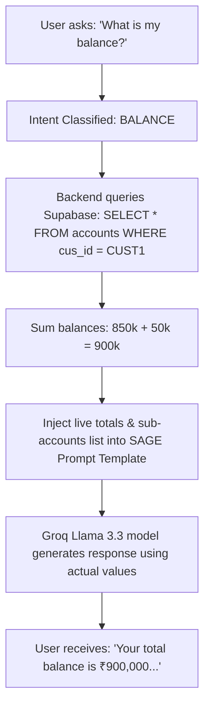
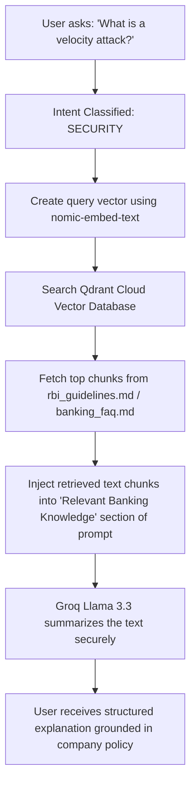

# SAGE AI Assistant System Reference

This document explains the internals of SAGE (Secure Assistant & Guidance Engine), including query workflows, prompt constructions, context orchestration, and security restrictions.

---

## 🤖 Introduction to SAGE
SAGE is a context-orchestrated virtual assistant integrated into the Secure Wealth app. Unlike generic LLM chatbots, SAGE is grounded on two live pillars:
1.  **Transactional Data (Core Context)**: Live account balances and risk scores queried from Supabase dynamically based on the authenticated user ID.
2.  **Domain Knowledge (Semantic Context)**: Regulatory guidelines (RBI), application help manuals, and internal security docs retrieved via semantic vector search.

---

## 🧭 Query Workflows

### Scenario A: Account Queries ("What is my balance?")
When a user asks about their financial balances, SAGE bypasses generic explanations and accesses real-time data:



#### Grounding Constraints Injected:
*   *\"If the user asks about their balance, you MUST answer using ONLY the exact values from Account Information... NEVER say you cannot access account information.\"*

---

### Scenario B: Security Queries ("What is a velocity attack?")
When a user asks about general security protocols or banking rules, the RAG pipeline is queried to retrieve grounded documentation:



---

## ✍️ Prompt Design & System Instructions

Here is the exact template compiled dynamically in `index.js` for `POST /ai-chat`:

```text
You are SAGE, an AI banking assistant.

User Question:
[User Query Text]

Account Information:
[Dynamic JSON containing balances, account IDs, and types]

Fraud Context:
[Dynamic Risk Scores and severity details if intent is FRAUD]

Relevant Banking Knowledge:
[Deduplicated and reranked text snippets from Qdrant Cloud]

Rules:
* If the user asks about their balance, savings, or account money, you MUST answer using ONLY the exact values from Account Information above.
* Report the Total Balance as the primary answer (e.g. "Your total account balance is ₹900,000.").
* If multiple accounts exist, also list individual account balances.
* NEVER invent, estimate, or round balances. Use the exact numbers from Account Information.
* NEVER say you cannot access account information.
* NEVER return generic banking explanations when account data is available.
* Never perform transactions.
* Never transfer money.
* Never invest on behalf of users.
* Only provide explanations and guidance.
```

---

## 🛡️ Security Restrictions & Guardrails

To prevent jailbreaks, prompt injections, and unauthorized actions:
1.  **Strict Action Interception**: Any message containing action verbs (*send, transfer, pay, withdraw, purchase*) triggers an immediate backend block response before LLM inference, ensuring the LLM can never simulate or trick the user into thinking a transfer has been processed.
2.  **Strict Output Limits**: SAGE operates in a non-state-mutating container. The prompt restricts SAGE to informational answers only:
    *   *\"Never perform transactions. Never transfer money. Never invest on behalf of users. Only provide explanations and guidance.\"*
3.  **Low Temperature Setting**: Classification and completions are set to low temperatures (`0.2` to `0.3`) to prevent hallucinations and enforce strict adherence to the provided context.
