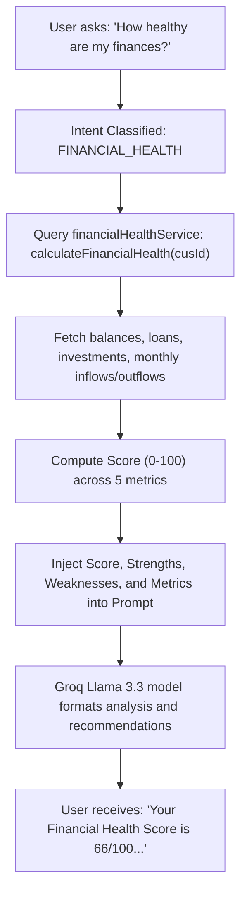
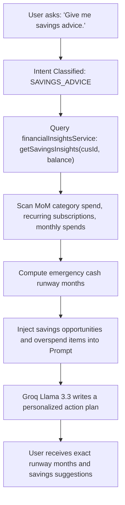

# SAGE AI Financial Copilot System Reference

This document explains the internals of SAGE (Secure Assistant & Guidance Engine) as an AI Financial Copilot, including query workflows, prompt designs, context orchestration pipelines, and security guardrails.

---

## 🤖 Introduction to SAGE Copilot
SAGE has evolved from a general Banking Assistant into an active AI Financial Copilot. It aggregates real-time analytical insights directly from your transactions, accounts, investments, and loan tables in Supabase to provide financial advice, risk scoring, and spending breakdowns.

SAGE is grounded on three core data pillars:
1.  **Transactional Analytics**: Dynamic week-over-week/month-over-month spending differences, average daily spending, category breakdowns, and top expenses.
2.  **Financial Health Assessment**: Consolidated financial health score calculated from savings rates, outstanding debt levels, portfolio ratio, and liquid cash runway.
3.  **Domain Policy Knowledge (RAG)**: Policies, security guidelines, and help documents retrieved via semantic search on Qdrant Cloud.

---

## 🧭 Query Workflows & Pipelines

### Scenario A: Financial Health Analysis ("How healthy are my finances?")
When a user queries their financial health, SAGE calculates a mathematical score dynamically and summarizes it using LLM:



---

### Scenario B: Savings Advice ("Give me savings advice.")
When a user asks how to save money, SAGE pulls overspending outliers, subscription summaries, and runway metrics:



---

## ✍️ Upgraded Prompt Design

Here is the exact template compiled dynamically in `index.js` for `/ai-chat`:

```text
You are SAGE, an AI Financial Copilot.

User Question:
[User Query Text]

=== CONTEXT ===

Account Information:
[Dynamic JSON containing balances, account IDs, and types]

Weekly/Monthly Spending Analysis:
[Week-over-Week and Month-over-Month spends, trends, average daily spends]

Expense Categories Breakdown:
[Debit sums grouped by transaction category]

Top 10 Largest Expenses:
[Sorted list of top 10 largest debit amounts and merchants]

Savings Advisor Insights:
[Category spikes, recurring subscriptions, savings opportunity, runway months]

Suspicious Transaction Detection:
[Flagged transactions with computed risk scores and evidence reasons]

Fraud Explainability Details:
[Risk score and rule contribution breakdown for the last transaction]

Investment Holdings Summary:
[Total portfolio asset amounts and list of active investments]

Financial Health Score & Assessment:
[Health Score 0-100, lists of strengths/weaknesses, inflows vs outflows]

Relevant Banking & Security Knowledge (RAG Docs):
[Deduplicated and reranked text snippets from Qdrant Cloud]

=== RULES ===
* You MUST answer user questions using the actual, live data provided in the CONTEXT sections above.
* Report the overall total account balance primarily if queried about balance (e.g. "Your total account balance is ₹900,000.").
* Never invent, estimate, or round balances, transaction records, risk scores, or spending figures. Always use exact numbers.
* Never say you cannot access account or transaction data if it is populated in the context above.
* Never return generic answers when live financial analysis data is present.
* Strictly enforce safety limits: SAGE cannot perform transactions, transfer money, or invest on behalf of users. Only provide explanations, analysis, and recommendations.
```

---

## 🛡️ Security Guardrails

SAGE implements multi-stage guardrails:
1.  **Keyword Interception**: Messages requesting actions (*transfer money, buy stock, pay bill*) are blocked at the router layer before calling the LLM.
2.  **Context Pinning**: The LLM prompt restricts SAGE from using anything outside the provided `CONTEXT` blocks for balances or spending calculations, preventing halluncinations.
3.  **Low Temperature Tuning**: Completed queries use a temperature of `0.2` to ensure responses are deterministic and grounded.
