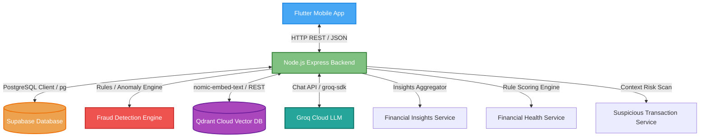
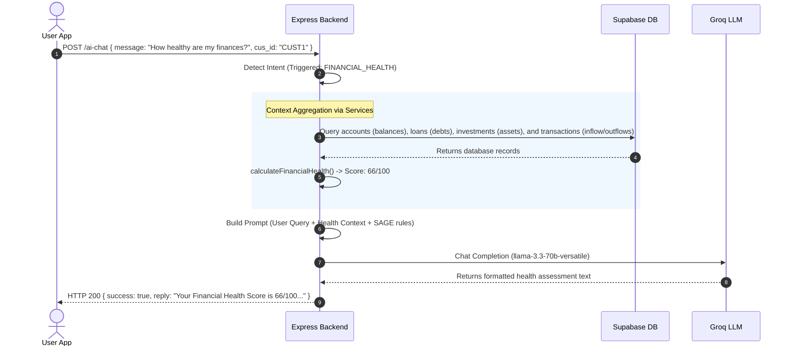

# System Architecture Manual

This document details the high-level architecture, dynamic pipelines, and request lifecycles of the WealthWise application with its upgraded AI Financial Copilot engine.

---

## 🏗️ High-Level System Architecture

The application is structured around a decoupled Client-Server architecture. The Flutter mobile app communicates directly with a Node.js API Gateway, which coordinates access to databases, search databases, fraud rule engines, and cloud AI services.

---

## ⚙️ Core Architectural Components

### 1. Intent Detection System (Upgraded)
Before processing queries through SAGE, the backend routes them to an Intent Classifier. 
*   **Keyword Matches (Immediate)**: High-speed overrides check for specific triggers (e.g. *savings advice, financial health, highest expenses, suspicious transactions, why flagged*) to map the query immediately to one of the 11 intents, guaranteeing accuracy and eliminating LLM classification latency.
*   **LLM Classifier (Fallback)**: When no keywords trigger, a strict zero-temperature classification prompt runs against Groq to assign one of the 11 intents: `BALANCE`, `SPENDING_ANALYSIS`, `EXPENSE_BREAKDOWN`, `TOP_EXPENSES`, `SAVINGS_ADVICE`, `SUSPICIOUS_TRANSACTIONS`, `FRAUD_EXPLAINABILITY`, `INVESTMENT_SUMMARY`, `FINANCIAL_HEALTH`, `SECURITY`, or `GENERAL_BANKING`.

### 2. Transaction Analytics Engine
*   **Weekly & Monthly Trends**: Compares aggregate debits (`ABS(amount)`) in the current calendar period vs. the previous period to calculate trend metrics.
*   **Category breakdown**: Groups debits by categories (Food, Travel, Bills, Shopping, Entertainment, etc.) over the last 30 days.
*   **Top Expenses**: Identifies the top 10 largest debit transactions by merchant name and amount.

### 3. Rule-Based Fraud Detection Engine
An analytical service that assesses transaction risks before writing records.
*   **Behavioral Rules**: Tracks geo-velocity parameters (e.g. Kolkata to Delhi traveling speed anomalies), transaction timestamps, transaction frequency bursts (velocity attacks), and proxy/VPN networks.
*   **Risk Scores**: Outputs a risk rating `0-100` and flags transactions as `LOW`, `MEDIUM`, or `HIGH` severity.

### 4. RAG Pipeline (Retrieval-Augmented Generation)
SAGE draws context from local knowledge files (`rbi_guidelines.md`, `banking_faq.md`, `app_help.md`) stored semantically.
*   **Search**: Converts the user's message into an embedding vector via local Ollama `nomic-embed-text` and queries **Qdrant Cloud** vector search.
*   **Dedup & Reranking**: Deduplicates matches from the same source file and reranks them using a composite semantic scoring algorithm.

---

## 🚦 Exposed REST API Endpoints

The backend exposes these core endpoints for mobile integration:

| Method | Endpoint | Description | Payload Schema |
|---|---|---|---|
| `POST` | `/ai-chat` | Core copilot conversation gateway | `{ "message": string, "cus_id": string }` |
| `POST` | `/financial-insights` | Retrieves WoW, MoM, and daily spending averages | `{ "cus_id": string }` |
| `POST` | `/financial-health` | Computes score (0-100) and details metrics | `{ "cus_id": string }` |
| `POST` | `/suspicious-transactions` | Scans history for anomalous debits and alerts | `{ "cus_id": string }` |
| `POST` | `/expense-analysis` | Fetches category breakdown and top 10 expenses | `{ "cus_id": string }` |
| `POST` | `/savings-advice` | Accesses subscription trackers and runway months | `{ "cus_id": string }` |
| `POST` | `/rag-search` | Directly queries vector database | `{ "query": string }` |
| `GET` | `/health` | Live service health check status | `N/A` |

---

## 🔄 Complete Request Lifecycle Flow

Here is a sequence trace showing how SAGE processes a Financial Health score request:

