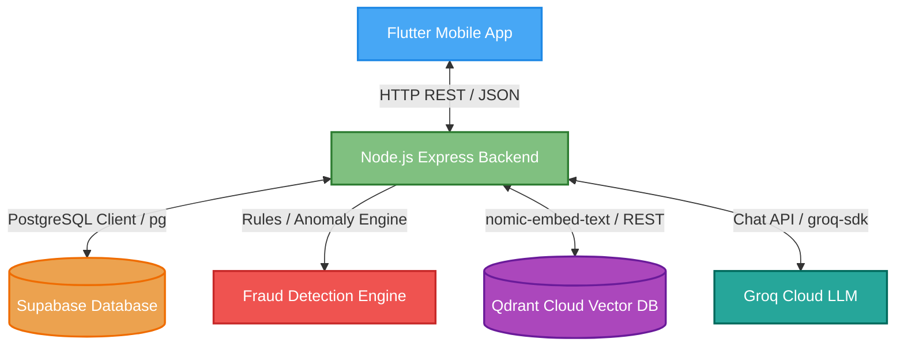
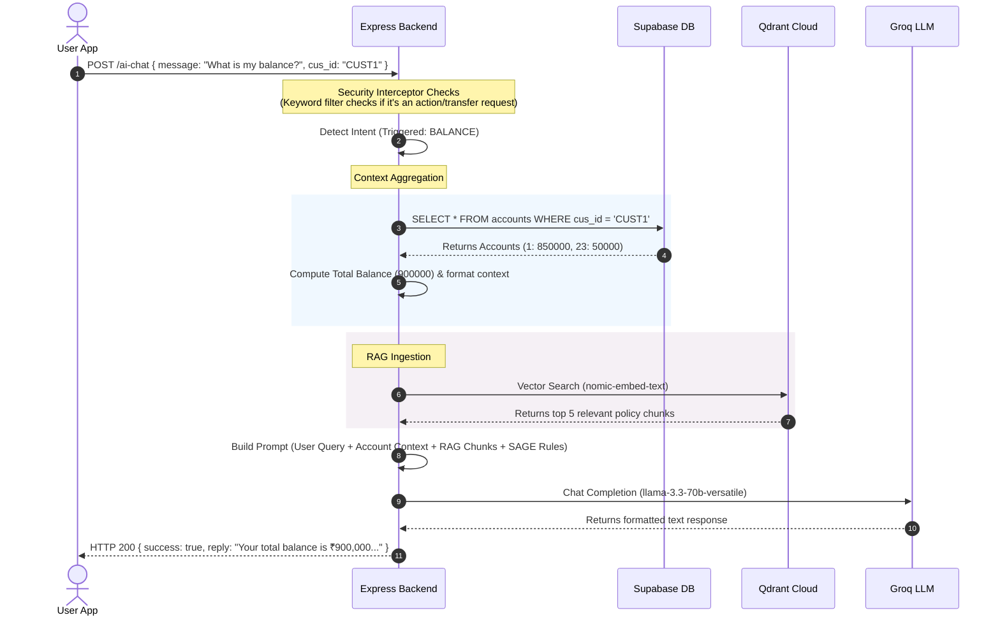

# System Architecture Manual

This document details the high-level architecture, dynamic pipelines, and request lifecycles of the Secure Wealth application.

---

## 🏗️ High-Level System Architecture

The application is structured around a decoupled Client-Server architecture. The Flutter mobile app communicates directly with a Node.js API Gateway, which coordinates access to databases, search databases, fraud rule engines, and cloud AI services.

---

## ⚙️ Core Architectural Components

### 1. Intent Detection System
Before processing queries through SAGE, the backend routes them to an Intent Classifier. 
*   **Keyword Matches (Immediate)**: High-speed override rules match queries matching phrases like *balance, savings, spend, transaction history, fraud, flagged, security, mfa* to prevent LLM latency or model misclassification.
*   **LLM Classifier (Fallback)**: When no keywords trigger, a strict zero-temperature classification prompt runs against Groq to assign one of the 5 intents: `BALANCE`, `SPENDING`, `FRAUD`, `SECURITY`, or `GENERAL_BANKING`.

### 2. Rule-Based Fraud Detection Engine
An analytical service that assesses transaction risks before writing record data to the SQL DB.
*   **Behavioral Rules**: Tracks geo-velocity parameters (e.g. traveling from Kolkata to Delhi too fast), transaction timestamps, transaction frequency bursts (velocity attacks), and proxy/VPN networks.
*   **Risk Scores**: Outputs a risk rating `0-100` and flags transactions as `LOW`, `MEDIUM`, or `HIGH` severity.
*   **Security Lockouts**: High-severity events lock transactions and set a `reauth_required` flag on the account, requiring immediate user biometric verification (face scan/passcode verification) to release the funds.

### 3. RAG Pipeline (Retrieval-Augmented Generation)
SAGE draws context from local knowledge files (` rbi_guidelines.md`, `banking_faq.md`, `app_help.md`) stored semantically.
*   **Search**: Converts the user's message into an embedding vector via local Ollama `nomic-embed-text` and queries **Qdrant Cloud** vector search.
*   **Dedup & Reranking**: Deduplicates matches from the same source file and reranks them using a composite semantic scoring algorithm before assembling the top 5 chunks into the prompt context.

### 4. Live Account Context Aggregation
For queries with a `BALANCE` or `SPENDING` intent:
*   Queries the Supabase `accounts` table for all accounts owned by the authenticated `cus_id`.
*   Iteratively sums up account balances (Savings, Checking) to calculate a single total balance matching the user's dashboard interface.
*   Formats the balances into structured context injected directly into the SAGE prompt template.

### 5. Security Guardrails
SAGE enforces absolute runtime safety policies before submitting inputs to the LLM:
*   **Action Filters**: Intercepts requests containing transaction keywords like *send, transfer, pay, withdraw, purchase, buy*.
*   **Denial Handlers**: Blocks transaction requests with a clean notice directing the user to complete payments through safe in-app menus. SAGE is strictly restricted from performing mutations.

---

## 🔄 Complete Request Lifecycle Flow

Here is a step-by-step trace of how a chat query (e.g., `"What is my account balance?"`) flows through the application:

